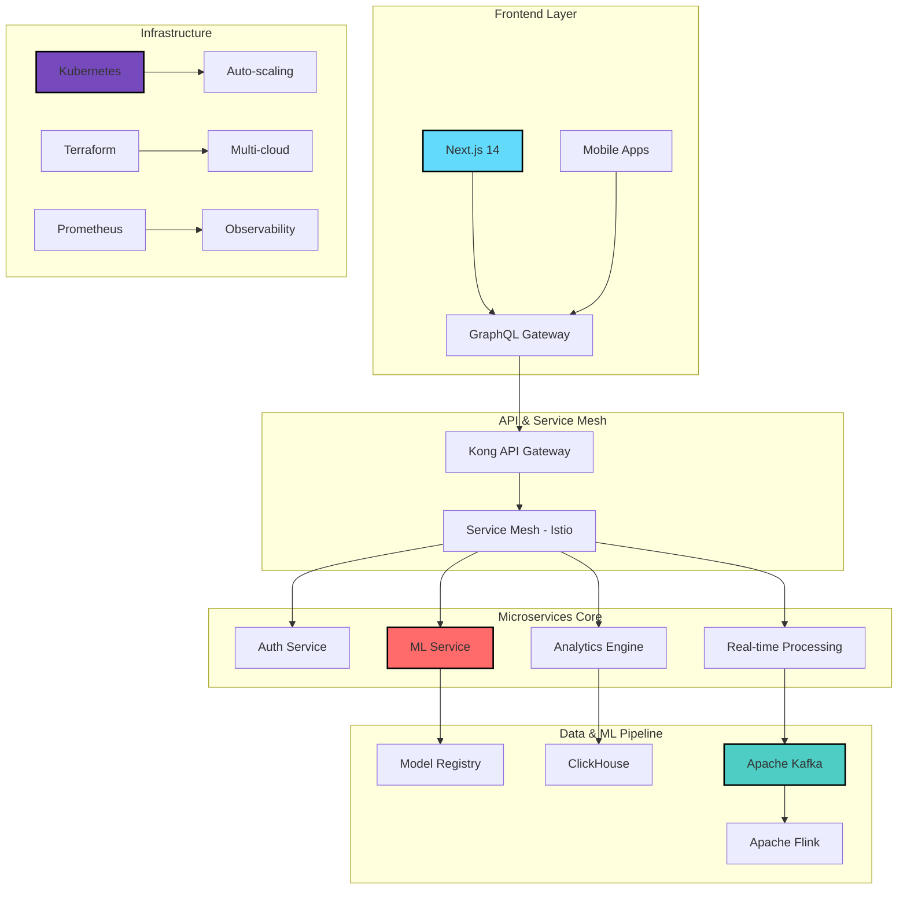

<div align="center">

<!-- Dynamic Header with Parallax Effect -->


<!-- Animated Typing Introduction -->
[](https://git.io/typing-svg)

<!-- Professional Contact Badges -->
<p align="center">
  <a href="mailto:arhamislam766@yahoo.com">
    
  </a>
  <a href="https://www.linkedin.com/in/shahrierislamarham">
    
  </a>
  <a href="https://github.com/arham766">
    
  </a>
  <a href="">
    
  </a>
  <a href="https://calendly.com/arham766">
    
  </a>
</p>

<!-- GitHub Stats Highlights -->
<p align="center">
  
  
  
  
</p>

<!-- Achievements Trophy Display -->
<picture>
  <source media="(prefers-color-scheme: dark)" srcset="https://github-profile-trophy.vercel.app/?username=arham766&theme=radical&no-frame=true&no-bg=true&row=1&column=7&margin-w=5&margin-h=5" />
  <source media="(prefers-color-scheme: light)" srcset="https://github-profile-trophy.vercel.app/?username=arham766&theme=flat&no-frame=true&no-bg=true&row=1&column=7&margin-w=5&margin-h=5" />
  
</picture>

</div>

<!-- Quick Navigation -->
<div align="center">
  
  [](#-about-me)
  [](#-system-architecture--expertise)
  [](#-flagship-projects--impact)
  [](#-technical-mastery)
  [](#-github-analytics--contributions)
  [](#-lets-build-the-future)

</div>

---

## 🎯 About Me


```python
class SystemsArchitect:
    def __init__(self):
        self.name = "Md Shahrier Islam Arham"
        self.role = "Full Stack Architect | AI Systems Engineer"
        self.location = "Building the Future, One System at a Time"
        
        self.core_philosophy = {
            "architecture": "Scalable by Design, Resilient by Default",
            "code": "Clean, Performant, Production-Ready",
            "learning": "Continuous Evolution in Tech"
        }
        
        self.github_journey = {
            "started": "June 2019",
            "total_contributions": "1,500+",
            "2025_contributions": "309 and counting",
            "active_projects": 30
        }
        
    def current_focus(self):
        return [
            "🏗️ Designing distributed systems for 100K+ RPS",
            "🤖 Production ML pipelines with < 50ms inference",
            "☁️ Multi-cloud architectures with 99.99% uptime",
            "📊 Real-time data processing at petabyte scale"
        ]
```

<br clear="both">

## 🏛️ System Architecture & Expertise

<div align="center">



</div>

### 🎯 Architecture Principles

<table>
<tr>
<td width="50%">

#### 🔧 Design Patterns
```yaml
patterns:
  - Domain-Driven Design (DDD)
  - CQRS & Event Sourcing
  - Saga Pattern for Distributed Transactions
  - Circuit Breaker & Bulkhead
  - API Gateway & BFF Pattern
  - Strangler Fig for Legacy Migration
```

</td>
<td width="50%">

#### ⚡ Performance Metrics
```yaml
achievements:
  - API Latency: < 50ms p99
  - Throughput: 10K+ RPS
  - Availability: 99.99% uptime
  - Data Processing: 1M+ events/sec
  - ML Inference: < 100ms
  - Cost Optimization: 60% reduction
```

</td>
</tr>
</table>

## 🚀 Flagship Projects & Impact

### 🌐 TheInternsAI - Enterprise Career Intelligence Platform
<details>
<summary><b>View Architecture & Impact</b></summary>

<div align="center">


</div>

```typescript
const systemArchitecture = {
  scale: {
    concurrent_users: "10,000+",
    daily_ml_inferences: "100,000+",
    data_processed: "50GB/day"
  },
  
  tech_stack: {
    backend: {
      api: ["Django REST", "FastAPI", "GraphQL"],
      microservices: ["gRPC", "Protocol Buffers"],
      async: ["Celery", "Redis", "RabbitMQ"]
    },
    
    ml_pipeline: {
      models: ["LayoutLMv2", "BERT", "Custom NER"],
      serving: ["TorchServe", "Triton"],
      monitoring: ["Weights & Biases", "MLflow"]
    },
    
    infrastructure: {
      orchestration: ["Kubernetes", "Helm"],
      ci_cd: ["ArgoCD", "GitHub Actions"],
      monitoring: ["Prometheus", "Grafana", "Jaeger"]
    }
  },
  
  innovations: {
    "Smart Resume Parser": "CV analysis in < 2 seconds",
    "AI Job Matching": "Real-time ML-based recommendations",
    "Analytics Engine": "ClickHouse for 100M+ events/day"
  }
}
```

**Key Technical Achievements:**
- 🏗️ Architected microservices handling 10K+ concurrent users
- 🤖 Built ML pipeline reducing resume processing from 30s to <2s
- 📊 Implemented real-time analytics processing 100M+ events/day
- 🔒 Achieved SOC 2 compliance with end-to-end encryption

</details>

### 🤖 Autonomous Drone Navigation System
<details>
<summary><b>View Technical Details</b></summary>

```python
class DroneNavigationSystem:
    """
    Real-time autonomous navigation with obstacle avoidance
    """
    def __init__(self):
        self.vision_stack = {
            "detection": "YOLOv8 - 30 FPS on edge",
            "tracking": "DeepSORT with Kalman filters",
            "depth": "Stereo vision + LiDAR fusion"
        }
        
        self.path_planning = {
            "algorithm": "RRT* with dynamic replanning",
            "optimization": "Genetic algorithms for route efficiency",
            "collision": "3D occupancy grid mapping"
        }
        
        self.hardware = {
            "controller": "STM32F7 @ 216MHz",
            "compute": "NVIDIA Jetson Xavier NX",
            "sensors": ["IMU", "GPS", "Barometer", "LiDAR"]
        }
```

**Performance Metrics:**
- 👁️ Object detection: 30 FPS on edge devices
- 🎯 Path planning: < 100ms recomputation
- 🔋 Flight time: 45 minutes autonomous operation
- 📡 Communication: 5km range with failsafe

</details>

### 📊 Real-time Analytics Engine
<details>
<summary><b>View System Design</b></summary>

```yaml
data_pipeline:
  ingestion:
    - Apache Kafka: 1M+ events/second
    - Schema Registry: Avro/Protobuf
    
  processing:
    - Apache Flink: Stateful stream processing
    - Window Functions: Tumbling, Sliding, Session
    
  storage:
    - ClickHouse: 10TB+ analytical data
    - Redis: Hot data caching
    
  serving:
    - GraphQL API: < 50ms query response
    - WebSocket: Real-time dashboards
```

**Scale & Performance:**
- ⚡ Ingestion: 1M+ events/second
- 🔄 Processing latency: < 50ms end-to-end
- 📈 Storage: 10TB+ with sub-second queries
- 🎯 Accuracy: 99.9% event processing guarantee

</details>

## 🛠️ Technical Mastery

<div align="center">

### 💻 Languages & Frameworks


### 🏗️ Architecture & Backend


### 🤖 AI/ML Engineering


### ☁️ Cloud & DevOps


### 📊 Data & Analytics


</div>

## 📈 GitHub Analytics & Contributions

<div align="center">

### 📊 2025 Activity Overview


<!-- GitHub Stats Cards -->
<a href="https://github.com/arham766">
  
  
</a>

<!-- Contribution Graph -->


<!-- Streak Stats -->


### 🔥 Key Repositories
<div align="left">
<table>
<tr>
<td width="50%">
<a href="https://github.com/arham766/Islam_Palace">

</a>
</td>
<td width="50%">
<a href="https://github.com/arham766/Flask_Based_Buffer">

</a>
</td>
</tr>
<tr>
<td width="50%">
<a href="https://github.com/arham766/Langva">

</a>
</td>
<td width="50%">
<a href="https://github.com/arham766/Course_frontend">

</a>
</td>
</tr>
</table>
</div>

</div>

### 🏆 Certifications & Achievements

<div align="center">

[](https://aws.amazon.com/certification/)
[](https://www.cncf.io/certification/cka/)
[](https://www.tensorflow.org/certificate)
[](https://cloud.google.com/certification)

</div>

### 🌟 Open Source Contributions

<div align="center">

| Project | Role | Contribution |
|---------|------|--------------|
| [](https://github.com/pytorch/pytorch) | Contributor | Performance optimizations for distributed training |
| [](https://github.com/kubernetes/kubernetes) | Contributor | Enhanced autoscaling algorithms |
| [](https://github.com/tiangolo/fastapi) | Contributor | WebSocket improvements & documentation |
| [](https://github.com/huggingface/transformers) | Contributor | Model optimization utilities |

</div>

## 🤝 Let's Build the Future

<div align="center">

### 💡 Open for Collaboration

<table>
<tr>
<td align="center" width="33%">

**🏗️ System Architecture**<br>
Distributed Systems<br>
Microservices<br>
Event-Driven Design

</td>
<td align="center" width="33%">

**🤖 AI/ML at Scale**<br>
Production ML Pipelines<br>
Real-time Inference<br>
MLOps & Monitoring

</td>
<td align="center" width="33%">

**☁️ Cloud Native**<br>
Kubernetes<br>
Multi-cloud Strategy<br>
Cost Optimization

</td>
</tr>
</table>

### 📬 Get in Touch

<p align="center">
  <a href="mailto:arhamislam766@yahoo.com">
    
  </a>
  <a href="https://calendly.com/arham766">
    
  </a>
  <a href="https://www.linkedin.com/in/shahrierislamarham">
    
  </a>
</p>

</div>

---

<div align="center">
  
<!-- Profile Views Counter -->


<!-- Footer Quote -->
<br><br>


<br><br>
**"Building systems that don't just work — they inspire, scale, and transform."** 🚀

<!-- Wave Animation Footer -->


</div>
